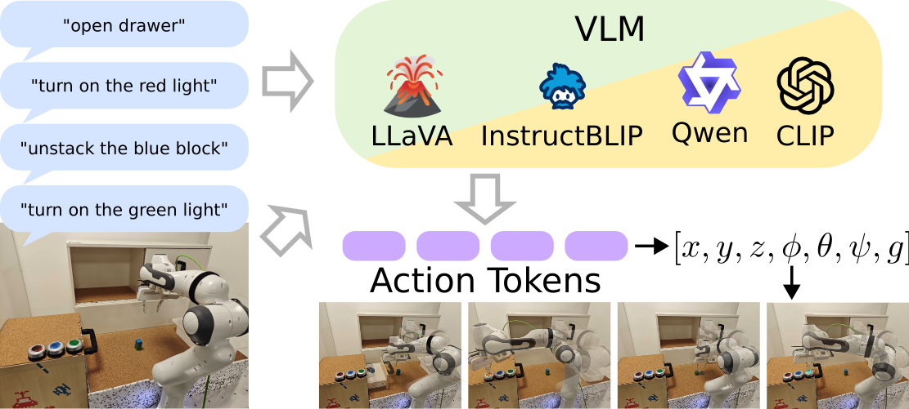

## RoboVLM

This is an open-source implementation tailored for utilizing VLMs in
instruction-based robot control. This implementation supports
a variety of VLM architectures and facilitates straightforward
integration of new models. 




The approach implemented here is similar to
[RT-2](https://arxiv.org/abs/2307.15818). 
Different from RT-2, we support open-source Vision Language Models (VLMs) like BLIP, LLava, and QWen. 


[//]: # (We use our framework to train multiple VLMs and evaluate them on a physical robot.)


## Installation

```
conda create -n llamaex python=3.10
```

For cuda 11, required if nvidida driver is too old
```
conda install pytorch torchvision torchaudio pytorch-cuda=11.8 -c pytorch -c nvidia
```

```
pip install transformers transformers[torch] datasets evaluate torchvision sentencepiece accelerate open_clip_torch
pip install scikit-learn scipy wandb absl-py nltk rouge_score loralib bitsandbytes git+https://github.com/huggingface/peft.git matplotlib

```

For evaluation
```
pip install opencv-python hydra-core
```
TF cpu version for loading the dataset
```
pip install https://storage.googleapis.com/tensorflow/linux/cpu/tensorflow_cpu-2.15.0-cp310-cp310-manylinux_2_17_x86_64.manylinux2014_x86_64.whl
```
For open-x dataset
```
pip install dm-reverb rlds tensorflow-datasets
```

For Qwen
```
pip install open_clip_torch install tiktoken einops transformers_stream_generator
```
For Qwen 4bit
```
pip install optimum
```
and depending on pytorch cuda version and pytorch version install autogptq, 
select version from https://github.com/AutoGPTQ/AutoGPTQ/blob/main/docs/INSTALLATION.md . E.g.
```
pip install auto-gptq==0.6.0 --extra-index-url https://huggingface.github.io/autogptq-index/whl/cu118/
```

Maybe flash attention, check hardware compatibility
Follow https://github.com/Dao-AILab/flash-attention?tab=readme-ov-file#installation-and-features
```
FLASH_ATTENTION_SKIP_CUDA_BUILD=TRUE pip install flash-attn --no-build-isolation
```

## Run an experiment


